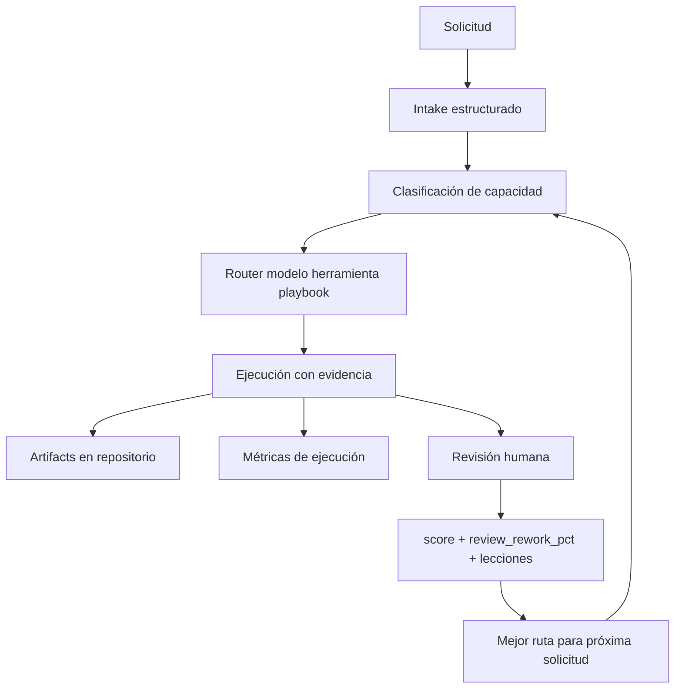

# Capability Orchestrator

Orquestador de solicitudes basado en capacidades: convierte peticiones crudas de producto, QA, soporte o negocio en casos trazables y reutilizables.

La idea no es que un agente "responda mejor una vez". La idea es que cada solicitud deje un aprendizaje para la siguiente.

## Empieza aquí

Si es la primera vez que usas este repo con un requerimiento real, empieza por [FIRST-RUN.md](./FIRST-RUN.md).

Para presentar el modo de trabajo a un equipo, usa [docs/WORKING-MODE.md](./docs/WORKING-MODE.md).

Resumen rápido:

1. Pon los archivos recibidos en `inputs/inbox/<case-id>/`.
2. [Ejecuta dry-run](./FIRST-RUN.md#paso-2-correr-dry-run).
3. Revisa `runs/<case-id>/`.
4. El orquestador recomienda el destino real; la persona aprueba si va a issue/PR, repo de arquitectura, SOP/artifact o preguntas abiertas.

## Antes / después

### Antes

```text
Solicitud llega a una persona
  -> reexplica contexto y restricciones
  -> el agente analiza dentro de una conversación
  -> se crea plan / repo / PR / SOP (Standard Operating Procedure / procedimiento operativo estándar) según el caso
  -> la persona revisa y corrige
  -> parte del aprendizaje queda disperso
```

### Después

```text
Solicitud entra
  -> Intake estructurado
  -> Clasificación de capacidad
  -> El orquestador enruta modelos + herramientas + playbook
  -> Se producen artifacts con evidencia
  -> Revisión humana registra score y review_rework_pct (porcentaje del resultado que tuvo que cambiarse después de revisión humana)
  -> Métricas y repositorio conservan señales
  -> La siguiente solicitud no empieza desde cero
```

La diferencia es simple: antes resolvemos cada caso; después construimos memoria reutilizable.

## Cómo se maneja la memoria reutilizable

Memoria reutilizable no significa guardar todo dentro del agente. Significa separar cada señal en la capa correcta para poder auditar, medir y reutilizar lo aprendido.

| Capa | Qué conserva | Ejemplo |
|---|---|---|
| Repositorio | Artefactos oficiales, decisiones, evidencias y trazabilidad compartible. | `runs/<case-id>/`, repos de arquitectura, issues, PRs, SOPs, checklists. |
| Tracking de métricas | Métricas de ejecución y calidad. | costo, latencia, modelo usado, `human_score`, `review_rework_pct`, `accepted`. |
| Memoria del agente | Hechos estables y compactos sobre preferencias, entorno y convenciones. | estructura de carpetas, convenciones de docs. |
| Skills del agente | Procedimientos reutilizables que cambian cómo trabaja el agente. | playbook de despliegue, routing de modelos, handoff a repo de arquitectura. |
| Base de conocimiento | Conocimiento curado opcional, no transaccional. | mapas de dominio, notas por módulo, lecciones consolidadas. |
| Historial de sesión | Contexto conversacional recuperable, pero no fuente oficial. | búsquedas para recordar una discusión previa. |

Regla práctica:

```text
Si debe compartirlo el equipo -> repositorio.
Si debe medirse -> tracking de métricas.
Si cambia cómo trabajará el agente la próxima vez -> skill.
Si es un hecho estable y corto -> memoria del agente.
Si es conocimiento curado de dominio -> base de conocimiento.
```

Flujo esperado por caso:

```text
solicitud cruda
  -> inputs/inbox/<case-id>/        # material temporal
  -> runs/<case-id>/                # clasificación, evidencia y ruta
  -> destino durable aprobado       # issue/PR/repo/SOP/checklist
  -> revisión humana                # accepted, human_score, review_rework_pct
  -> tracking de métricas           # señales de aprendizaje
  -> skill/memoria                  # solo si deja una regla reutilizable
```

## Quién lo usa / ejecuta

Este repo se usa desde un agente de codificación, con intervención humana explícita.

El agente debe poder tomar una solicitud cruda y construir el intake lo más completo posible a partir de lo disponible: texto, conversación, screenshot, ticket, enlace, correo o notas. La persona solo completa lo que falte.

## Orden lógico

```text
1. Capturar solicitud cruda
2. Construir o completar inputs/inbox/<case-id>/request.md
3. Ejecutar dry-run (simulación sin cambios destructivos)
4. Generar runs/<case-id>/ con intake, clasificación, hechos y ruta recomendada
5. Revisión humana
6. Ejecutar solo lo aprobado
7. Registrar aprendizaje y métricas
```

## Qué significa cada paso

### Intake estructurado

Es pasar de un mensaje libre a una ficha mínima de trabajo, por ejemplo:

- descripción resumida del problema;
- ejemplos o evidencia inicial (screenshot, log, ticket, correo);
- contexto del dominio (cliente, módulo, ambiente);
- hechos confirmados;
- supuestos;
- preguntas abiertas.

### Clasificación de capacidad

La solicitud cruda se clasifica en uno o más tipos de trabajo.

| Capacidad | Uso típico | Salida |
|---|---|---|
| `business_intake` | Chat/audio/correo/screenshot aún no estructurado. | `request.yaml`, hechos, supuestos, preguntas. |
| `qa_bug_diagnosis` | Síntoma en QA/STG/PRD; separar hipótesis de causa raíz. | causa raíz, evidencia, siguiente acción. |
| `architecture_analysis` | Diseñar solución, ADR, plan o repo de arquitectura. | README, ADR, PLAN, VALIDATION. |
| `support_sop` | Convertir flujo técnico en guía operativa. | SOP (Standard Operating Procedure / procedimiento operativo estándar), checklist, validación. |
| `environment_promotion` | Backport/cherry-pick seguro entre ambientes. | drift report, branches, PRs, orden deploy. |
| `implementation` | Cambios de código ya aprobados. | branch, commits, tests, PR. |
| `research_comparison` | Comparar alternativas antes de decidir. | matriz, trade-offs, recomendación. |

Ejemplo:

```yaml
primary_capability: qa_bug_diagnosis
secondary_capabilities: [architecture_analysis, environment_promotion]
confidence: 0.84
needs_human_review: true
```

### Router de modelos

El orquestador enruta por capacidad. El modelo no es fijo; se elige por rol.

Ver [MODEL-ROUTING.md](./MODEL-ROUTING.md).

```text
Orquestador
  |
  +-- Arquitectura
  |     primary:   modelo de razonamiento profundo
  |     secondary: modelo generalista fuerte
  |     fallback:  modelo económico de razonamiento
  |
  +-- Implementación
  |     primary:   modelo de codificación
  |     secondary: modelo generalista fuerte
  |     fallback:  revisión humana
  |
  +-- Investigación
        primary:   modelo generalista fuerte
        secondary: modelo económico de razonamiento
        fallback:  modelo de razonamiento profundo para síntesis final
```

Esta es una hipótesis inicial. El tracking de métricas debe validarla con evidencia real: costo, latencia, calidad, score humano y `review_rework_pct`.

### Diagrama de operación



Nota del diagrama: `review_rework_pct` significa porcentaje del resultado que tuvo que cambiarse después de revisión humana.

## Para qué sirve este repo

Este repo no es para ejecutar producto ni para almacenar permanentemente todas las solicitudes entrantes. Es la fábrica: define el proceso, los contratos, las capacidades, el routing y los ejemplos mínimos.

La regla es:

```text
Todas las solicitudes pueden pasar por la lógica del orquestador.
No todas las solicitudes deben vivir dentro de este repo.
```

Los casos reales deberían terminar en el lugar que corresponda:

- issue o PR;
- repo de arquitectura específico;
- artifact/SOP aprobado;
- run temporal o muestra pequeña.

Sirve para:

- decidir qué tipo de solicitud entró;
- decidir qué capacidades se activan;
- elegir qué modelo jugará qué rol;
- producir artifacts consistentes;
- registrar revisión humana;
- aprender qué ruta funciona mejor.

## Carpetas

- [docs/README.md](./docs/README.md): documentos presentables para compartir el modo de trabajo.
- [inputs/README.md](./inputs/README.md): bandeja inicial para archivos de una nueva solicitud.
- [capabilities/README.md](./capabilities/README.md): qué capacidad existe, cuándo se usa y qué produce.
- [schemas/README.md](./schemas/README.md): contratos de entrada y revisión humana.
- [config/README.md](./config/README.md): configuración de routing y defaults.
- [scripts/README.md](./scripts/README.md): entrypoints y runners.
- [runs/README.md](./runs/README.md): salidas generadas por cada caso.
- [examples/README.md](./examples/README.md): casos semilla y patrones reutilizables.

## MVP

El MVP es un runner local que toma una solicitud cruda y la convierte en una salida estructurada para revisión.

No busca automatizar todo; busca responder bien tres cosas:

1. ¿Qué es esta solicitud?
2. ¿Qué falta para resolverla?
3. ¿Qué ruta/modelo/playbook conviene usar?

### Primer intento recomendado

Ver la guía corta en [FIRST-RUN.md](./FIRST-RUN.md).

Si tienes varios archivos de entrada para un nuevo requerimiento, no los mezcles en el README ni en `runs/`. Ponlos en una carpeta del caso:

```text
inputs/inbox/<case-id>/
  raw-request.md
  screenshot-01.png
  correo-soporte.md
  log-error.txt
  links.md
```

La intención no es escribir manualmente todo el intake. La intención es que el agente o el runner lean esa carpeta y lo construyan al máximo desde el material disponible.

Modo con carpeta de archivos:

```bash
python scripts/run_request.py --input-dir inputs/inbox/<case-id> --case-id <case-id> --mode dry-run
```

Modo con texto crudo:

```bash
python scripts/run_request.py --raw "<texto o resumen inicial>" --case-id <case-id> --mode dry-run
```

O, si ya existe un archivo parcial:

```bash
python scripts/run_request.py --input inputs/inbox/<case-id>/request.md --mode dry-run
```

Si falta información, el runner debe dejarla como pregunta abierta, no inventarla.

Estructura objetivo que el runner debe crear o completar:

```md
# Solicitud

## Título

Resumen corto del caso.

## Origen

manual | chat | correo | reunión | ticket | spreadsheet | repositorio | otro

## Solicitud original

Texto original sin perder contexto.

## Contexto de negocio

- cliente:
- dominio:
- módulo:
- ambiente:

## Resultado esperado

Qué debería pasar al final.

## Restricciones

- restricción 1
- restricción 2

## Personas involucradas

- nombres o equipos involucrados

## Adjuntos / referencias

- links, tickets, screenshots, logs
```

La intención de esa primera corrida es obtener una versión ordenada del caso antes de hacer cambios mayores.

Ver [MVP.md](./MVP.md).

## Archivos clave

- [MODEL-ROUTING.md](./MODEL-ROUTING.md): roles, modelos primary/secondary/fallback.
- [CAPABILITIES.md](./CAPABILITIES.md): qué es una capacidad y cuándo se usa.
- [METRICS.md](./METRICS.md): qué se mide y por qué.
- [MVP.md](./MVP.md): por qué existe el runner local.
- [EXAMPLES.md](./EXAMPLES.md): casos semilla.
- [CHANGELOG.md](./CHANGELOG.md): trazabilidad de cambios y decisiones.

## Verificación

```bash
python3 -m unittest discover -s tests -v
```

## Estado

Exploratorio / diseño inicial.

No automatizar PRs, repos ni cambios destructivos sin aprobación humana explícita.

## Licencia

MIT. Ver [LICENSE](./LICENSE).
